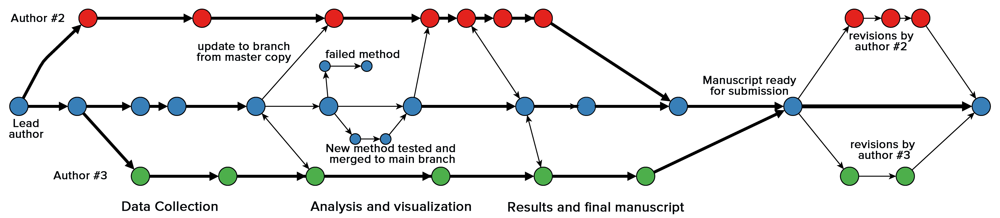

# git: A powerful tool to facilitate greater reproducibility and transparency in science.

**Karthik Ram**, Ph.D.  
Environmental Science, Policy, and Management.  
University of California, Berkeley.  
Berkeley, CA 94720. USA.  
[karthik.ram@berkeley.edu](mailto:karthik.ram@berkeley.edu)

## Abstract  
Reproducibility is the hallmark of good science [@Vink2012b]. Maintaining a high degree of transparency in scientific papers is essential not just for gaining trust and credibility within the scientific community but also essential for facilitating novel science. Sharing data and computer code associated with publications is becoming increasingly common, motivated partly in response to data deposition requirements from journals and mandates from funders. Despite this increase in transparency, it is still difficult to reproduce or build upon the findings of most scientific publications without access to a complete workflow.

Version control systems (VCS), which have long been used to maintain code repositories in the software industry, are now finding new applications in science. One such open-source VCS, **git**, provides a robust, feature-rich framework that is ideal for managing various artifacts of scientific endeavors such as data, code, figures, and manuscripts. In particular, git's decentralized and distributed nature make it ideal for asynchronous collaboration which is typical in science. Further, since each copy of a git repository contains the full history of changes along with authorship, it allows anyone to review, contribute, or build upon ongoing and completed projects. In this paper I review how git can be leveraged in science to increase reproducibility and transparency, foster collaboration, and support novel synthesis.

# Introduction

One of the original motivations behind publishing scientific articles was to ensure that results could be reproduced, validated and extended. Articles with detailed methods sections were necessary not just for evaluating the soundness of the central findings but also to ensure that readers could validate such findings and improve upon them. Over time, the scientific process has become quite complex, requiring increasing amounts of data collected using complex methods. The volume of research has also grown considerably over the years, resulting in a shortening of the length of articles (first because space was limiting in publications but later continued even though e-papers don't have any limitations). Now most papers contain brief methods. To reproduce the central findings of any paper, a reader not only requires access to detailed methods, but also the underlying data and code used to arrive at them. While this practice has become more common, there are several problem. Many articles still do not share their data and or code. There is also the problem that they are not shared in adequate detail (derived data versus raw data) or all authors do not share all the decisions they used to arrive at their final conclusions. So, some decisions, such as removing outliers, may not be adequately in the steps. 

Another problem is the rise in retractions in recent years. [@VanNoorden2011a]. Talk about why retractions are costly, hurt science, and are a bad thing overall.

Open science is needed to accelerate research. In the era of declining funding, we need to leverage existing data and code in new ways. Not only that we must also ensure that our data come with appropriate licenses that not only support fair use but also credit original authors [@Neylon2013]. Sharing git repositories with a full history of changes can be one way to lower barriers and accelerate open science. In this paper I describe why the distributed version control system **git** is ideal for supporting reproducible research.

Science is supposed to be reproducible. We shared all the relevant details necessary for someone else to reproduce, validate, or build upon existing findings. As technology has improved, so has the software and the size of data. These days methods sections are fairly short and rarely provide sufficient detail to reproduce the central findings, or build upon them. Even when sufficient raw materials are shared, producing a manuscript requires a research team to make several small decisions that are often relegated to lab
notebooks and rarely available for review. Some of these decisions could be vital, such as deciding to subset data, remove outliers, and or choosing one type of statistical model over another. Even if a researcher is open to sharing these types of information, there is often no venue to do so. Thus, we need a more robust way to share all the decisions that result in a manuscript, along with all the artifacts such as code and data.

### Version control systems
Version control systems (VCS) have long been used in software development for managing code bases. A key feature common to all such systems is that ability save versions of files during development along with informative comments, referred to as commit messages. Commits serve as anchor points where individual files or an entire project can be safely reverted to when necessary. Additionally, VCS also allow for creation of branches, where new approaches or ideas can be safely tested and incorporated once all issues have been worked out, without disrupting a project's development. Most VCS are centralized which require a connection to a central server along with appropriate privileges. 

Distributed version control systems like **git** offer several features that make it ideal for managing artifacts of scientific research. The most compelling feature of git is its decentralized and distributed nature. Every copy of a git repository can serve either as the server (a central point for synchronizing changes) or as a client. This ensures that there is no single point of failure. Authors can work asynchronously without being connected to a central server and synchronize their changes when possible. This is particularly useful when working rom remote field sites where internet connections are often slow or unavailable. Unlike other VCS, every copy of a git repository carries a complete history of all changes, including authorship, that can be viewed and searched by anyone. This feature allows new authors to build from any stage in the development of a project, including any of the branches used to explore alternate methods or ideas. git also has a small footprint and nearly all operations occur locally. Rather than maintaining multiple versions of the same file, git uses changesets (i.e. changes that occur between revisions), which makes it possible for every file to have its own history.  When changes are synchronized to remote copies, files are compressed before being transmitted further reducing the need for expensive hardware or high-speed internet connections.

The features that make git the popular choice among software developers also make it ideal for managing scientific products. Most importantly, git retains a complete provenance of changes with every single copy of a repository. Perhaps the biggest reason that makes git so well suited for tracking scientific research is that it maintains a history of authorship not just in the original repository but also in every single copy cloned by anyone. In the remainder of the article, I describe how key attributes of git can be used to benefit applications in science. Readers should note that the article is not meant to be a complete or thorough review of all of git's features.

## 1. git as a lab notebook  
Day to day decisions made over the course of a study are often logged for review and reference in lab notebooks. Such notebooks contain important information useful to both future readers attempting to replicating a study, or for careful reviewers seeking additional information. However, lab notebooks are rarely shared along with publications. git commit logs can serve as a proxies for lab notebooks if clear yet concise messages are included over the course of a project. One of the fundamental features of git that make it so useful to science is that every copy of a repository carries a complete history of changes available for anyone to review. These logs can be be easily searched to retrieve versions of artifacts like data and code. Third party tools can also be leveraged to mine git histories from one or more projects for other types of analyses.

##  2. Tracking Collaboration  
In collaborative efforts, authors contribute to one or more stages of the manuscript preparation such as collecting data, analyzing them, and/or writing up the results. Some journals even require authors to list their contributions when submitting an article. Such information is extremely useful for both readers and reviewers when assessing relative author contributions to a body of work. git provides a significantly more granular way track author contributions from the inception of a project.

When projects are tracked using git, every single action (such as additions, deletions, and changes) is attributed to an author. Multiple authors can choose to work on a single branch of a repository (the 'master' branch), or clone copies and work asynchronously. As each author adds their contribution, they can choose to sync those to the master branch and also update their copies at any time. Over time, all of the decisions that go into the production of a manuscript from entering data and checking for errors, to choosing appropriate statistical models and the most appropriate figures can be traced back to specific authors. 

With the help of a remote git hosting services, maintaining various copies in sync with each other becomes effortless. While most merges are automatic, conflicts will need to be resolved manually which would also be the case with most other workflows (e.g. using Microsoft Word with track changes). By syncing changes back and forth with a remote repository, every author can update their local copies as well as push their changes to the remote version at any time, all the while maintaining a complete audit trail. Mistakes or unnecessary changes can easily undone by reverting either the entire repository or individual files to earlier commits. In addition to facilitating easy collaboration, this process also makes it easy to assess relative author contributions when determining the order of authorship. Error or clarifications can also be directed to the appropriate author. 

In a recent paper led by Philippe Desjardins-Proulx [https://github.com/PhDP/article_preprint/network](https://github.com/PhDP/article_preprint/network) all of the authors (including me) successfully collaborated using only git and GitHub. In this particular git workflow, each of us cloned a copy of the main repository and contributed our changes back to the original author. Figures 2 and 3 show the list of collaborators and a network diagram of how and when changes were contributed back the master branch.

##  3. git as a backup and failsafe against data loss

Collecting new data and developing methods for analysis are often expensive endeavors requiring significant amounts of grant funding. Therefore protecting such valuable products from loss or theft is paramount. A recent study found that a vast majority of such products are stored on lab computers on web servers and often inaccessible after a certain period of time. One survey found that only from 72% of studies of 1000 surveyed still had data that were accessible [@Schultheiss2011; @Wren2004]. Hosting data and code publicly not only ensures protection against loss but also increases visibility for research efforts and provides opportunities for collaboration and early review [@Prlic2012b].

While git provides a powerful features that can leveraged by individual scientists, git hosting services open up a whole new set of possibilities. Any local git repository can be linked to one or more **git remotes**, which are copies hosted on a remote cloud severs. Git remotes serve as hubs for collaboration where authors with write privileges can contribute anytime while others can download up-to-date versions. There are currently several git hosting services such as SourceForge, Google Code, GitHub, and BitBucket that provide free git hosting. Among them, Github has surpassed other popular provides like Google Code and SourceForge and hosts over 2 million public repositories at the time of this writing [@github_popularity]. While these services are usually free for publicly open projects, some research efforts, especially those containing embargoed or sensitive data will need to be maintained privately. There are multiple ways to deal with such situations. For example, certain files can be excluded from git's history, others can be maintained as private sub-modules, or entire repositories can be kept private (with paid plans) and made public at a future time. A detailed discussion of the entire range of possibilities are beyond the scope of this article.

Managing a research project with git provides several safe guards against short-term loss. Frequent commits synced to remote repositories ensure that multiple versioned copies are accessible from anywhere. In projects involving multiple collaborators, the presence of additional copies makes even more difficult to lose work. While git hosting services provide protection against short term data loss, they are not a solution for more permanent archiving since none of them offer any such guarantees. For long-term archiving, researchers should submit their git-managed projects to academic repositories that are members of CLOCKSS. Output stored on such repositories are archived over a network of redundant nodes and ensure indefinite available across geographic and geopolitical regions.

## 4. Freedom to explore new ideas and methods
With git's effortless branching mechanism, there is almost no cost to creating branches for exploring alternate ideas without disrupting the flow of a project. Branches can be used to test new algorithms, explore better data visualization techniques, or to develop new analytical models. When branches yield successful outcomes, they can easily be merged into the master copy, while unsuccessful efforts can be left as-is to serve as a historic record. 
Branches can prove extremely useful when responding to reviewer comments about the choice of one method over another since the git history contains a record of failed or abandoned attempts. This is particularly useful since the time between submission and response can be fairly long. Additionally, future users can mine git histories to avoid repeating approaches that are inefficient or don't work.

##  5. As a mechanism to solicit feedback and reviews  
While it is possible to leverage most of core functionality in git at the local level, git hosting services offer additional advantages that can accelerate collaboration and review. Issue trackers can provide a mechanism for both feedback and review, especially since they can easily be linked to particular lines or blocks of code. 

##  6. Transparency, verifiability
Methods sections in papers are often brief and succinct to adhere to strict word limits imposed by journal guidelines. This practice is particularly common when describing well-known methods where authors assume a certain degree of familiarity among informed readers. One unfortunate consequence of this practice is that any modifications to the standard protocol implemented in a study are not available to the reviewers. However, seemingly small decisions, such as choosing an appropriate distribution to use in a statistical method, can have a disproportionately strong influence on the central conclusion of a paper. Without access to a detailed history, a reviewer competent in statistical methods has to give the benefit of the doubt to the authors and assume that assumptions of methods use where clearly met.
Sharing a git repository can remove these kinds of ambiguity and allow authors to point out commits where certain key decisions were made before using particular analytic approaches.

##  7. Managing large data 
git is extremely efficient with managing small data files such as ones routinely collected in experimental and observational studies. However, when the data are particularly large bioinformatics studies (in the order of tens of megabytes to gigabytes), managing them with git can degrade efficiency and slow down the performance of git operations. When large data files do not change often, it would be best to exclude such files from the repository by adding it to a ignore list, and tracking the metadata separately. In such cases, the best practice would be to exclude those data from the repository and only track the metadata. This protocol is especially ideal when such large datasets do not change often over the course of a study. In situations where the data are large and undergo frequent updates, one could leverage third party tools such as git-annex [http://git-annex.branchable.com/](http://git-annex.branchable.com/) which makes this process of managing data with separate remotes without any need to check the data into the repository.  The tool makes this process transparent to the user so it appears as though the data are being tracked by the same repository as the other project files.

## 8. Lower barriers to reuse
A common barrier that prevents someone from reproducing or building upon an existing method is lack of sufficient details about a method. Even in cases where methods are adequately described, the use of expensive proprietary software with restrictive licenses makes it difficult to do so. Sharing code with licenses that encourage fair use with appropriate attribution, removes such artificial barriers and encourages readers to modify methods to suit their research needs, improve upon them, or find new applications [@Neylon2012]. Analysis pipelines can be easily forked or branched from public git repositories and modified for novel applications. Although this process of depositing code somewhere public with appropriate licenses create additional work for the authors, the benefits clearly outweigh the costs. Making all research products publicly available not only increases citation rates [@Piwowar2007a] but can also increase opportunities for collaboration. For example, [@niedermeyer2012] struggled with finding appropriate software for comprehensive mass spectrum annotation, and eventually found an open source software to extend. In particular, the authors cite the open nature of the software as the catalyst for their choice. Examples of such collaboration and extension will only become more common by sharing fully versioned copies of projects.

A similar argument can be made for data as well. Even publications that deposit data in persistent repositories rarely share the original raw data. The versions submitted to persistent repositories are often cleaned datasets. In cases where no datasets are deposited, the only data accessible are mean values reported in the text. Raw data can be leveraged to answer questions not originally intended by the authors. For example, research questions that aim to address uncertainly often require messy raw data to test novel methods. Thus, versioned data provide opportunities to retrieve copies before they have been cleaned up for use in different contexts.  

# Conclusions  
Wider use of git has the potential to revolutionize scholarly communication and increase opportunities for reuse, novel synthesis and new collaborative efforts. With disciplined use of git, individual scientists and labs can ensure that research efforts are securely logged while maintaining author contributions in a system that provides security against data loss and encourages exploration of new approaches. In an era with shrinking research budgets, scientists are under increasing pressure to produce more with less. If more granular sharing via git reduces time spent developing new software, or repeating expensive data collection efforts, then everyone can benefit. Scientists should also be aware that these efforts don't have to viewed as entirely altruistic. In a recent mandate, the National Science Foundation (NSF) [@nsf2012] has expanded its merit guidelines to include a range of academic products such as software and data, in addition to peer-reviewed publications. With the rise in use of altmetric tools, such efforts can benefit everyone [@Piwowar2013].

Despite the strong arguments that I laid out in previous sections, using git is not particularly easy and comes with a non-insignificant learning curve. Although scientists spent considerable time using and creating their own software, knowledge of good programming practices, including the use of VCS, are rarely taught [@Wilson2012]. Therefore wider adoption of useful tools like git requires greater software development literacy among scientists. On an optimistic note, this literacy is slowly increasing with the new generation of scientists and as the result of efforts such as Software Carpentry [http://software-carpentry.org/](http://software-carpentry.org/).

## Acknowledgements  
I was supported by NSF DEB-`1021553` while preparing this manuscript. Comments from ... on earlier drafts greatly improved the final version of this article. This manuscript is available as a git repository (with a full history of changes) [https://github.com/karthikram/smb_git.git](https://github.com/karthikram/smb_git.git) along with a permanent archived copy on figshare (http://figshare.com/) (I'll add a link to figshare URL once a final version of the paper is accepted).

## Literature Cited  

