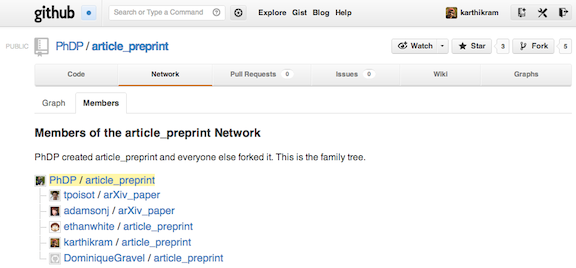
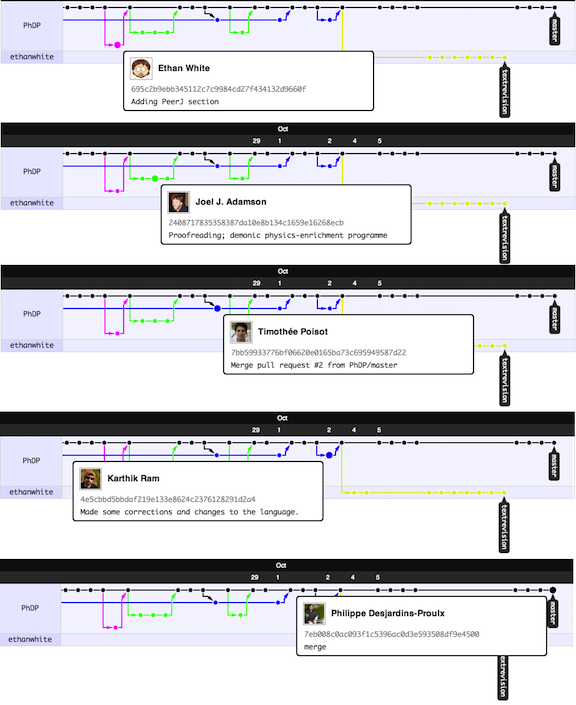

# git can facilitate greater reproducibility and increased transparency in science.

**Karthik Ram**, Ph.D.  
Environmental Science, Policy, and Management.  
University of California, Berkeley.  
Berkeley, CA 94720. USA.  
[karthik.ram@berkeley.edu](mailto:karthik.ram@berkeley.edu)

## Abstract  
Reproducibility is the hallmark of good science. Maintaining a high degree of transparency in scientific papers is essential not just for gaining trust and credibility within the scientific community but also essential for facilitating the development of new ideas. Sharing data and computer code associated with publications is becoming increasingly common, motivated partly in response to data deposition requirements from journals and mandates from funders. Despite this increase in transparency, it is still difficult to reproduce or build upon the findings of most scientific publications without access to a more complete workflow.

Version control systems (VCS), which have long been used to maintain code repositories in the software industry, are now finding new applications in science. One such open-source VCS, **git**, provides a robust, feature-rich framework that is ideal for managing various artifacts of scientific endeavors such as data, code, figures, and manuscripts. In particular, git is a lightweight and distributed system that records a complete timeline of events that occur over the evolution of a research project. Since the system is distributed, collaborators can work asynchronously and merge their contributions as needed. The decentralized nature ensures that this rich history, including authorship trail, is available with every copy of a repository for anyone to review, contribute, or build upon. In this paper I review reasons why scientists should leverage this software technology in their day to day research workflow to increase reproducibility and transparency, foster collaboration, and support novel synthesis.

# Introduction

Reproducible science provides the critical standard by which published results are judged and central findings are either validated or refuted [@Vink2012b]. Reproducibility also allows others to build upon existing work and use it to develop new ideas and methods. Advances in technology over the years have resulted in application of complex methodologies that have enabled us to collect ever increasing amounts of data. While repeating expensive studies are not always possible, a whole host of other reasons have contributed to the problem of reproducibility [@Peng2011]. One such reason has been the lack of sufficient access to underlying data and code used for analysis, which can provide opportunities for others to verify claims. In an era rife with costly retractions, scientists have an increasing burden to be more transparent to maintain a high level of credibility [@VanNoorden2011a]. When data and code shared in sufficient detail, these artifacts can also be repurposed and brought to bear on new research questions not anticipated by the original authors. 

Unrestricted sharing of data and code, which is the primary aim of open science, lowers the barriers needed to increase transparency, it can also serve as a powerful catalyst that can accelerate progress. In the era of limited funding, we need to leverage existing data and code to the fullest extent to solve both applied and basic problems. This requires that scientists share their research artifacts more openly, with reasonable licenses that encourage fair use while providing credit to original authors [@Neylon2013]. Besides overcoming social challenges to these issues, existing technologies can also be leveraged to increase reproducibility.

Version control systems (VCS) have long been used in software development for managing code bases. A key feature common to all such systems is that ability save versions of files during development along with informative comments which are referred to as commit messages. Commits serve as anchor points where individual files or an entire project can be safely reverted to when necessary. Additionally, VCS also allow for creation of branches where new approaches or ideas can be safely tested without disrupting a project's development and incorporated once all issues have been resolved. Most traditional VCS are centralized which means that they require a connection to a central server which maintains the master copy. Users with appropriate privileges can check out copies, make changes and upload them back to the server.

Distributed version control systems like **git** offer additional several features that make it ideal for managing artifacts of scientific research. The most compelling feature of git is its decentralized and distributed nature. Every copy of a git repository can serve either as the server (a central point for synchronizing changes) or as a client. This ensures that there is no single point of failure. Authors can work asynchronously without being connected to a central server and synchronize their changes when possible. This is particularly useful when working from remote field sites where internet connections are often slow or unavailable. Unlike other VCS, every copy of a git repository carries a complete history of all changes, including authorship, that can be viewed and searched by anyone. This feature allows new authors to build from any stage in the development of a project, including any of the branches used to explore alternate methods or ideas. git also has a small footprint and nearly all operations occur locally. Rather than maintaining multiple versions of the same file, git uses *changesets* (i.e. changes that occur between revisions), which makes it possible for every file to have its own history. 

The features that make git the popular choice among software developers also make it ideal for managing scientific products. git repositories maintain a complete timeline of events along with notes describing such changes. Perhaps the biggest reason that makes git so well suited for tracking scientific research is that it maintains a history of authorship not just in the original repository but also in every single copy cloned by anyone. This rich history can be searched or mined by future scholars to extract useful bits of code or data, review methods, and check for errors among various other applications. 

## Use cases for git in science
git can be used to manage not only individual items like data, code, figures, and text, but also various combinations for different use cases such as maintaining lab notebooks, lectures, and entire manuscripts.

### Managing notes and manuscripts  
Although git can be used to version any types of files, its usefulnesss declines when used for binary files (such as Word documents) git can only differentiate that the file has changed but not compare line edits. When working with plain text formats such as markdown or `LaTeX`, git can highlight differences in text between any two versions.  

### Managing datasets  
Data are ideal for managing with git. These data can be ones manually entered via spreadsheets, recorded as part of surveys, or retrieved from sensors with logging capabilties. With each significant change or additions, commits can record such activities (e.g. "*Entered data collected between 12/10/2012 and 12/20/2012*", or "*Updated data from temperature loggers for December 2012*"). Over time, this process avoid proliferation of unmanagable files (the folder or directory only contains a single copy with changes stored in a hidden git folder), while the git history provides a way to browse these changes and revisit files in earlier states. When errors are discovered, earlier versions of files can be extracted and corrected without affecting other files in the project.

### Managing statistical analyses and figures  
When data are analyzed programmatically using software such as `R` and `Python`, code files start out small and become complex over time. Somewhere along the process, inadvertent errors such as misplaced subscripts can lead to serious errors down the line. When such errors are suspected well into a project, comparing versions of statistical scripts can provide a way to quickly trace the source of the problem and recover from them.

Figures that are published in a paper often undergo multiple revisions before resulting in a production copy. Without version control, one would have to deal with multiple copies and use inperfect information such as file creation dates to determine the order in which they were created. Without additional information, figuring out why certain versions were created (e.g. in response to comments from coauthors) also becomes harder to track. When figures are managed with git, the commit messages (e.g. "*Updated figure in response to Ethan's comments regarding use of normalized data.*") provide an unambiguous way to track various versions.

### Managing complete manuscripts
When all of the above artifacts are used in a single effort, such as writing a manuscript, git can collectively manage versions in a powerful way for both single authors and for projects involving multiple collaborators. This protocol avoids proliferation of unmanagable files with uninformative names (e.g. *final_1.doc, final_2.doc, final_final.doc, final_KR_1.doc* etc.)

The features that make git the popular choice among software developers also make it ideal for managing scientific products. git repositories maintain a complete timeline of events along with a history of changes. Perhaps the biggest reason that makes git so well suited for tracking scientific research is that it maintains a history of authorship not just in the original repository but also in every single copy cloned by anyone. This rich history can be searched or mined by future scholars to extract useful bits of code or data, review methods, and check for errors among various other applications. 

## 1. Lab notebook  
Day to day decisions made over the course of a study are often logged for review and reference in lab notebooks. Such notebooks contain important information useful to both future readers attempting to replicating a study, or for thorough reviewers seeking additional clarification. However, lab notebooks are rarely shared along with publications or made public although there are exceptions [@Wald2010]. Git commit logs can serve as a proxies for lab notebooks if clear yet concise messages are recorded over the course of a project. One of the fundamental features of git that make it so useful to science is that every copy of a repository carries a complete history of changes available for anyone to review. These logs can be be easily searched to retrieve versions of artifacts like data and code. Third party tools can also be leveraged to mine git histories from one or more projects for other types of analyses.

##  2. Tracking Collaboration  
In collaborative efforts, authors contribute to one or more stages of the manuscript preparation such as collecting data, analyzing them, and/or writing up the results.  Such information is extremely useful for both readers and reviewers when assessing relative author contributions to a body of work. With high profile journals now discouraging the practice of honorary authorship [@Greenland2012], git commit logs can provide a highly granular way to track and assess individual author contributions to a project.

When projects are tracked using git, every single action (such as additions, deletions, and changes) is attributed to an author. Multiple authors can choose to work on a single branch of a repository (the '*master*' branch), or in separate branches and work asynchronously. As each author adds their contribution, they can choose to sync those to the master branch and/or update their copies at any time. Over time, all of the decisions that go into the production of a manuscript from entering data and checking for errors, to choosing appropriate statistical models and creating figures, can be traced back to specific authors. 

With the help of a remote git hosting services, maintaining various copies in sync with each other becomes effortless. While most merges are automatic, conflicts will need to be resolved manually which would also be the case with most other workflows (e.g. using Microsoft Word with track changes). By syncing changes back and forth with a remote repository, every author can update their local copies as well as push their changes to the remote version at any time, all the while maintaining a complete audit trail. Mistakes or unnecessary changes can easily undone by reverting either the entire repository or individual files to earlier commits. Since commits are attributed to specific authors, error or clarifications can also be appropriately directed. 

In a recent paper led by Philippe Desjardins-Proulx [https://github.com/PhDP/article_preprint/network](https://github.com/PhDP/article_preprint/network) all of the authors (including me) successfully collaborated using only git and GitHub ([https://github.com/]([@Vink2012b])). In this particular git workflow, each of us cloned a copy of the main repository and contributed our changes back to the original author. Figures 2 and 3 show the list of collaborators and a network diagram of how and when changes were contributed back the master branch.

##  3. Backup and failsafe against data loss

Collecting new data and developing methods for analysis are often expensive endeavors requiring significant amounts of grant funding. Therefore protecting such valuable products from loss or theft is paramount. A recent study found that a vast majority of such products are stored on lab computers on web servers which are prone to failure and often inaccessible after a certain length of time. One survey found that only from 72% of studies of 1000 surveyed still had data that were accessible [@Schultheiss2011; @Wren2004]. Hosting data and code publicly not only ensures protection against loss but also increases visibility for research efforts and provides opportunities for collaboration and early review [@Prlic2012b].

While git provides a powerful features that can leveraged by individual scientists, git hosting services open up a whole new set of possibilities. Any local git repository can be linked to one or more **git remotes**, which are copies hosted on a remote cloud severs. Git remotes serve as hubs for collaboration where authors with write privileges can contribute anytime while others can download up-to-date versions or submit revisions with author approval. There are currently several git hosting services such as SourceForge, Google Code, GitHub, and BitBucket that provide free git hosting. Among them, Github has surpassed popular provides like Google Code and SourceForge and hosts over 2 million public repositories at the time of this writing [@github_popularity]. While these services are usually free for publicly open projects, some research efforts, especially those containing embargoed or sensitive data will need to be kept private. There are multiple ways to deal with such situations. For example, certain files can be excluded from git's history, others maintained as private sub-modules, or entire repositories can be made private (with paid plans) and opened to the public at a future time. 

Managing a research project with git provides several safe guards against short-term loss. Frequent commits synced to remote repositories ensure that multiple versioned copies are accessible from anywhere. In projects involving multiple collaborators, the presence of additional copies makes even more difficult to lose work. While git hosting services provide protection against short term data loss, they are not a solution for more permanent archiving since none of them offer any such guarantees. For long-term archiving, researchers should submit their git-managed projects to academic repositories that are members of CLOCKSS. Output stored on such repositories (e.g. figshare) are archived over a network of redundant nodes and ensure indefinite availability across geographic and geopolitical regions.

## 4. Freedom to explore new ideas and methods
With git's effortless branching mechanism, there is almost no cost to creating branches for exploring alternate ideas in a structured and documented way without disrupting the central flow of a project. Branches provide a risk-free way to test new algorithms, explore better data visualization techniques, or develop new analytical models. When branches yield successful outcomes, they can easily be merged into the master copy while unsuccessful efforts can be left as-is to serve as a historic record. 
Branches can prove extremely useful when responding to reviewer questions about the rationale for choosing one method over another since the git history contains a record of failed, unsuitable, or abandoned attempts. This is particularly helpful given that the time between submission and response can be fairly long. Additionally, future users can mine git histories to avoid repeating approaches that were never fruitful in earlier efforts.

##  5. Mechanism to solicit feedback and reviews  
While it is possible to leverage most of core functionality in git at the local level, git hosting services offer additional services such as issue trackers, collaboration graphs, and wikis. These can easily be used to assign tasks, manage milestones, and maintain lab protocols. Issue trackers can be repurposed as a mechanism for soliciting both feedback and review, especially since they comments can easily be linked to particular lines of code or blocks of text. 

##  6. Transparency, verifiability
Methods sections in papers are often brief and succinct to adhere to strict word limits imposed by journal guidelines. This practice is especially common when describing well-known methods where authors assume a certain degree of familiarity among informed readers. One unfortunate consequence of this practice is that any modifications to the standard protocol implemented in a study may not available to the reviewers and readers. However, seemingly small decisions, such as choosing an appropriate distribution to use in a statistical method, can have a disproportionately strong influence on the central findings of a paper. Without access to a detailed history, a reviewer competent in statistical methods has to give the benefit of the doubt to the authors and assume that assumptions of methods used were clearly met.
Sharing a git repository can remove these kinds of ambiguity and allow authors to point out commits where certain key decisions were made before using particular analytic approaches. Journals could facilitate this process by allowing authors to submit links to their git repository along with their submitted manuscript.

##  7. Managing large data 
git is extremely efficient with managing small data files such as ones routinely collected in experimental and observational studies. However, when the data are particularly large such as those in bioinformatics studies (in the order of tens of megabytes to gigabytes), managing them with git can degrade efficiency and slow down the performance of git operations. When large data files do not change often, the best practice would be to exclude those data from the repository and only track changes in metadata. This protocol is especially ideal when  large datasets do not change often over the course of a study. In situations where the data are large and undergo frequent updates, one could leverage third party tools such as git-annex [http://git-annex.branchable.com/](http://git-annex.branchable.com/) and still seamlessly use git to manage a project.

## 8. Lowering barriers to reuse
A common barrier that prevents someone from reproducing or building upon an existing method is lack of sufficient details about a method. Even in cases where methods are adequately described, the use of expensive proprietary software with restrictive licenses makes it difficult to use. Sharing code with licenses that encourage fair use with appropriate attribution removes such artificial barriers and encourages readers to modify methods to suit their research needs, improve upon them, or find new applications [@Neylon2013]. With open source software, analysis pipelines can be easily *forked* or branched from public git repositories and modified to answer other questions. Although this process of depositing code somewhere public with appropriate licenses involves additional work for the authors, the overall benefits outweigh the costs. Making all research products publicly available not only increases citation rates [@Piwowar2007a] but can also increase opportunities for collaboration. For example, [@niedermeyer2012] describe their struggle with finding appropriate software for comprehensive mass spectrum annotation, and eventually found an open source software which they where able to extend. In particular, the authors cite availability of complete source code along with an open license as the motivation for their choice. Examples of such collaboration and extensions are likely to become more common with increased availability of fully versioned projects.

A similar argument can be made for data as well. Even publications that deposit data in persistent repositories rarely share the original raw data. The versions submitted to persistent repositories are often *cleaned* and finalized versions of datasets. In cases where no datasets are deposited, the only data accessible are likely mean values reported in the main text or appendix of a paper. Raw data can be leveraged to answer questions not originally intended by the authors. For example, research questions that aim at addressing uncertainly often require messy raw data to test competing methods. Thus, versioned data provide opportunities to retrieve copies before they have been modified for use in different contexts and have lost some of their utility.  

# Conclusions  
Wider use of git has the potential to revolutionize scholarly communication and increase opportunities for reuse, novel synthesis and new collaborative efforts. With disciplined use of git, individual scientists and labs can ensure that the entire timeline of events that occur over the development of a research project are securely logged in a system that provides security against data loss and encourages risk-free exploration of new ideas and approaches. In an era with shrinking research budgets, scientists are under increasing pressure to produce more with less. If more granular sharing via git reduces time spent developing new software, or repeating expensive data collection efforts, then everyone stands to benefit. Scientists should note that these efforts don't have to viewed as entirely altruistic. In a recent mandate the National Science Foundation [@nsf2012] has expanded its merit guidelines to include a range of academic products such as software and data, in addition to peer-reviewed publications. With the rise in use of altmetric tools that track and credit such efforts, then everyone can benefit [@Piwowar2013].

Although I have laid out various arguments for why more scientists should be using git, one should be careful not to view git as a one stop solution to all the problems facing reproducibility in science. Although the basic features of git can be readily used without any knowledge of command line tools, leveraging the full power of git, especially when working on complex projects where one might encounter unwieldy merge conflicts, comes at a significant learning cost. While time invested in becoming proficient in git would be valuable in the long-term, most scientists do not have the luxury of learning software skills that do not address more immediate problems. Despite the fact that scientists spent considerable time using and creating their own software to address domain specific needs, good programming practices are rarely taught [@Wilson2012]. Therefore wider adoption of useful tools like git will require greater software development literacy among scientists. On an more optimistic note, such literacy is slowly becoming common in the new generation of scientists, driven in part by efforts such as Software Carpentry [http://software-carpentry.org/](http://software-carpentry.org/) and newer courses taught in graduate curricula (e.g. [Programming for biologists](http://www.programmingforbiologists.org/) taught at Utah State University).

## Acknowledgements  
I was supported by NSF DEB-`1021553` while preparing this manuscript. Comments from Carl Boettiger, Scott Chamberlain, **…**, and **…** on earlier drafts greatly improved the final version of this article. This manuscript is available both as a git repository (with a full history of changes) [https://github.com/karthikram/smb_git.git](https://github.com/karthikram/smb_git.git) and also as a permanent archived copy on figshare (http://figshare.com/) (I'll add a link to figshare URL once a final version of the paper is accepted). I also thank the rOpenSci project ([http://ropensci.org](http://ropensci.org)) for helping me gain a greater appreciation for git as a tool for advancing science.

## Literature Cited  

